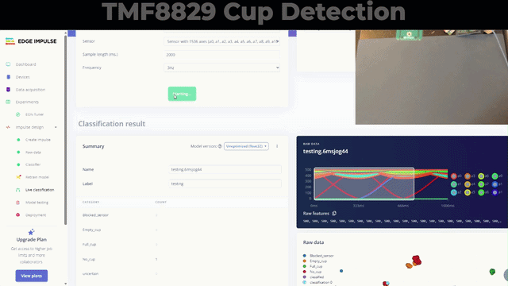
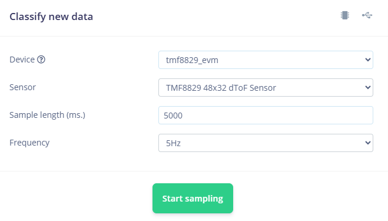

# Edge Impulse TMF8829 training and live classification interface

Implementation of a [Edge Impulse](https://www.edgeimpulse.com/) interface for
- Training of AI models
- Running live classification

This interface operates on
[TMF8829_EVM_DB_DEMO](https://ams-osram.com/products/boards-kits-accessories/kits/ams-tmf8829-evm-db-demo-evaluation-kit)
or [TMF8829_EVM_EB_SHIELD](https://ams-osram.com/products/boards-kits-accessories/kits/ams-tmf8829-evm-eb-shield-evaluation-kit) boards.

Example classification for cup detection, proof of concept, where TMF8829 is located 30 cm above the desk looking downwards - the AI model is available at Edge Impulse website: [TMF8829_48x32_cup_detection](https://studio.edgeimpulse.com/public/1037705/latest):



## Setup

* TMF8829 EVM connected to PC - TMF8829_EVM_DB_DEMO or TMF8829_EVM_EB_SHIELD
* [Edge Impulse](https://www.edgeimpulse.com/) account

Create an API Key in https://studio.edgeimpulse.com/

Goto Project Dashboard -> Keys -> New API keys, create a key and copy the key number from the browser to [tmf8829_edge_impulse.py](./tmf8829/zeromq/tmf8829_edge_impulse.py)

```python
API_KEY = "ei_<insert_key_here>"
```

For live classification to work, add a HMAC Keys as well. This key needs to have 'Set as development key' checked. The API_KEY above is not affected by the HMAC key and there is no need to copy it to these sources.

## Installation

### Virtual environment

Recommendation is to set-up a virtual environment. Open your favourite Windows PowerShell, VisualStudio Code etc.
To install a virtual environment named env, and use it:   
python -m venv env
./env/Scripts/Activate.ps1

### Install libraries

Python version 3.10.11 or higher is required.

To run the scripts in this folder you need to install the packages in the requirements.txt file with:
```bash
pip install -r requirements.txt
```

All required python packages are inside the subdirectory packages.

## Usage

If you are using [TMF8829_EVM_EB_SHIELD](https://ams-osram.com/products/boards-kits-accessories/kits/ams-tmf8829-evm-eb-shield-evaluation-kit), 
start [tmf8829_zeromq_server.py](./tmf8829/zeromq/tmf8829_zeromq_server.py) first; this can be done with 
the pre-compiled server file from [TMF8829_Driver_ZMQ_Server_Client_EXE_\<latest version\>.zip](https://ams-osram.com/tmf8829) or inside a separate shell
```python
python tmf8829/zeromq/tmf8829_zeromq_server.py
```
If you are using [TMF8829_EVM_DB_DEMO](https://ams-osram.com/products/boards-kits-accessories/kits/ams-tmf8829-evm-db-demo-evaluation-kit), 
no additional server needs to be started.

### Training data

To collect training data, update label as needed in [tmf8829_edge_impulse.py](./tmf8829/zeromq/tmf8829_edge_impulse.py)

```python
# Set Training Label
TRAINING_LABEL = 'Empty_cup'
```

To start collecting data, run [tmf8829_zeromq_training_client.py](./tmf8829/zeromq/tmf8829_zeromq_training_client.py)

```python
python tmf8829/zeromq/tmf8829_zeromq_training_client.py
```

This will automatically copy the collected and labeled training data to the Edge Impulse project defined by the API_KEY.

### Live classification

First start the client [tmf8829_live_classification.py](./tmf8829/zeromq/tmf8829_live_classification.py)
```python
python tmf8829/zeromq/tmf8829_live_classification.py
```

Go to the Edge Impulse project and connect to the TMF8829 device:



### Visualization on the PC

The EVM GUI can be used in parallel to this application, but needs to be started AFTERWARDS.

### Configuration

Update file [cfg_client.json](./tmf8829/zeromq/cfg_client.json) with following examples:
- Parameter **period** [in ms] to modify speed of detection. 
- Parameter **iterations** [in k iterations] is used to change performance of detection


# Info

This is a fork of [tmf8829_driver_python](https://github.com/ams-OSRAM/tmf8829_driver_python) modifying files to create an application, which can run together with TMF8829_EVM_DB_DEMO or TMF8829_EVM_EB_SHIELD.
